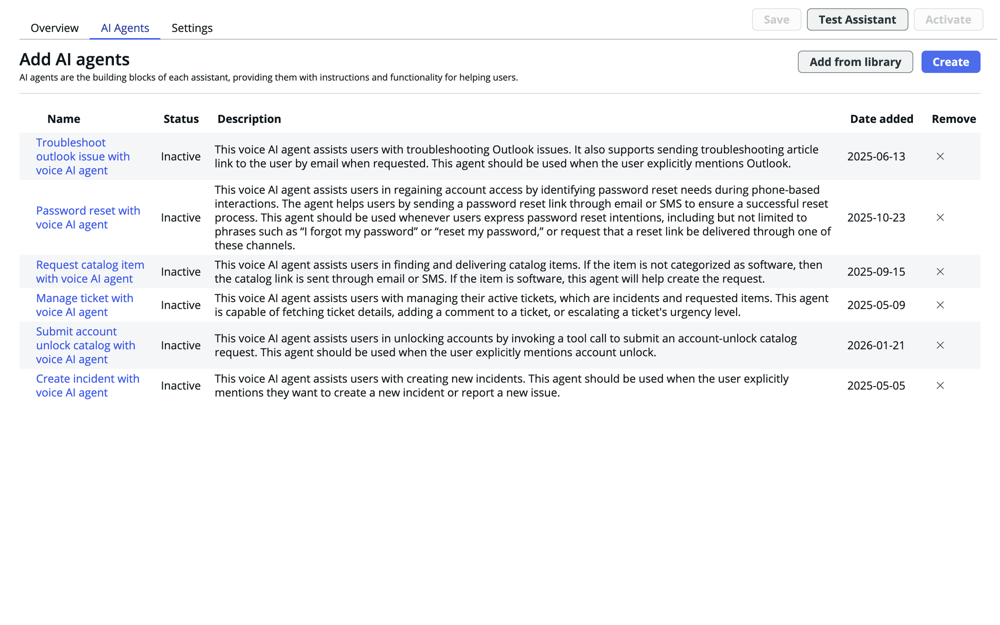

# LAB8114-K26

**Prevent and Resolve Incidents With Autonomous Workers, Chat and Voice AI, and DEX**

---

## Introduction and Objectives

IT support teams face mounting pressure as ticket volumes grow, employee expectations rise, and skilled agents become harder to retain. Too often, routine incidents — password resets, application crashes, device issues — consume the same time and attention as complex, high-impact problems. In this lab, you will experience firsthand how ServiceNow's Zero Touch Support capabilities transform the IT service desk by connecting Voice AI, the L1 Service Desk AI Specialist, and Digital End-user Experience (DEX) into a seamless, autonomous support pipeline.

From the moment an employee picks up the phone to the moment their laptop issue is remediated — without a single human agent involved — you'll see how these components work together to increase self-service and deflection rates, accelerate time to resolve, elevate service quality, and boost employee productivity and customer satisfaction.

**By the end of this lab, you will be able to:**

1. Configure a Voice AI Assistant to greet and triage incoming calls using natural language.
2. Set up and activate the L1 Service Desk AI Specialist to autonomously classify, investigate, and resolve incidents.
3. Review the DEX remediation trigger AI agent and understand how it executes device-level fixes without human intervention.
4. Run a complete end-to-end Zero Touch Support flow — from an employee's phone call through autonomous resolution and device remediation.
5. Monitor AI worker performance, activity, and feedback through built-in dashboards.
6. Author and publish a knowledge article, then watch the AI Specialist use it to deflect a matching incident.

---

## Lab Personas

This lab uses three personas. You will switch between them as instructed throughout the exercises.

> **Note:** Passwords for all non-admin users are `Password123!` unless your facilitator specifies otherwise.
>
> **Impersonation** is used in this lab. To impersonate a user, select your user avatar in the top-right corner and choose **Impersonate another user**. When finished, return to the same menu and select **End impersonation**.

| User | Role | Description |
|------|------|-------------|
| **System Administrator** | ServiceNow Developer | The person configuring the Zero Touch Service Desk. This is **you** — you'll set up the Voice AI assistant, configure the L1 Service Desk AI Specialist, verify the DEX agent, and validate the end-to-end flow. |
| **Able Tutor** | Employee, Product Management | A typical employee who experiences an IT issue and contacts the service desk for help. Able is the **Caller** on incidents created during the Challenge and Bonus rounds. |
| **Bernard Laboy** | Knowledge Manager / Approver | The designated approver for knowledge articles in the IT Knowledge Base. You will **impersonate** this user during the Bonus Challenge to approve your knowledge article before it can be published. |

---

## Getting Started

No pre-work is required for this lab. Your lab instance comes pre-loaded with the necessary applications, plugins, and demo data. Simply log in and jump straight into the exercises.

1. Open your browser and navigate to your assigned lab instance URL (provided by your facilitator).
2. Log in as the **System Administrator** using the credentials provided.
3. Confirm you can see the **Shared admin dashboard** on the home page.
4. You're ready to go!

---

## Lab Agenda — 90 Minutes

| Time | Section | Description |
|------|---------|-------------|
| 0:00 – 0:10 | **Welcome & Scene Setting** | Meet the lab hosts, learn the Zero Touch Support vision, and hear about the challenge prizes. |
| 0:10 – 0:25 | **Live End-to-End Demo** | Watch a complete incident lifecycle: employee calls in → Voice AI triages → AI Specialist resolves → DEX remediates the device. |
| 0:25 – 0:37 | **Module 1: Voice AI Setup** | Configure your Voice AI assistant with a custom personality, agents, and communication channels. |
| 0:37 – 0:55 | **Module 2: L1 Service Desk AI Specialist** | Set up the AI Specialist's profile, classification, triage, knowledge sources, execution mode, and activation. |
| 0:55 – 1:05 | **Module 3: DEX Remediation Agent** | Verify the DEX remediation trigger AI agent is active and review its supported remedial actions. |
| 1:05 – 1:15 | **Challenge Round** | Trigger your own end-to-end Zero Touch flow. First 10 to complete it win a prize! Proctors will circulate to help. |
| 1:15 – 1:25 | **Bonus Challenge** | Author a knowledge article, get it approved and published, then create a matching incident and watch the AI Specialist deflect it using your content. |
| 1:25 – 1:30 | **Q&A & Wrap-Up** | Open questions, additional resources, and session survey. |

> **Need help?** Raise your hand and a proctor will come to you. Don't spend more than 2 minutes stuck — we want you to finish the challenge round!

## Lab Modules

| Module | File | Duration |
|--------|------|----------|
| Module 1 | Voice AI Setup & Configuration | ~12 min |
| Module 2 | L1 Service Desk AI Specialist — Setup & Configuration | ~18 min |
| Module 3 | DEX Remediation Agent — Review & Verification | ~10 min |
| Challenge | End-to-End Challenge Round | ~10 min |
| Bonus | Bonus Challenge — Create a Knowledge Article | ~10 min |

---

## Exercise 1: Voice Assistant Configuration and Testing

> **Use the guided setup experience within Assistant Designer to explore your Voice Assistant**

1. In the navigation menu, go to: **All > Conversational Interfaces > Assistant Designer**
2. From the *Assistants* pane, select **Now Assist Voice Deployment.**
3. From the *AI Agents* pane, you will see a list of agents already assigned to the Assistant. There should be one agent **Create incident with voice AI agent** active already. We will activate an additional agent.

4. Select the **Manage incident with voice AI agent** from the list.
5. Navigate to the **Select channels and status** section and toggle the agent active and click **Done.**
6. Now navigate back to the Assistant Designer and you should see the agent is active.
7. Navigate to the **Settings** tab. In the *Basic Details* pane, feel free to edit with sample details:
   - **Name:** IT Service Desk Assistant
   - **Description:** AI Voice Assistant that will handle Tier 0 calls across the technology organization - creating incidents, processing requests, providing INC/CHG status, troubleshooting Apps, and more.
   - **Tags:** Choose the tag icon on the right. Then type `Technology`, followed by Enter, to apply the new tag
   - Select **Save and Continue**

8. In the *Voice Personality* pane, fill in the following details:
   - **Language:** English
   - **Welcome Message:** Hello, and thank you for calling Otto Enterprises. How may I assist you today?
   - **Persona:** Explore a few of the voice personas, using the play button to sample the voices.
   - Select the **Help Desk Man** persona and then tap **Save and Continue**

9. In the *Communication Channels* pane, we will be using a dummy Twilio setup for testing purposes:
   - **Provider:** Twilio
   - **Provider application:** AI Voice Agent Provider Application
   - **Phone number to live agent:** *any number can work here*
   - **Authentication token:** *any number sequence can work here*
   - Select **Save and Continue**

   > In your instance, you will either configure for a CCaaS Integration (Telephony Provider) or a Mobile App integration.

10. In the *Authentication* pane, review the following:
    - **Caller Identification:** Primary - Phone number
    - **Authentication:** Primary - SoftPIN

    > For today's lab session, we will not be changing the authentication methods, but you can explore the preconfigured settings.

11. In the *Safeguards* pane:
    - Select **Connect to a live agent**
    - Examine the values listed for the Max Call Duration and Inactivity Timeout call constraints
    - Select **Save and Continue**

    > Safeguards are a great way to ensure the Voice Agent delivers a premier caller experience. This includes the voice agent knowing when it's time to pass caller to a human agent or open a record for the issue.

12. Under the *Review* pane:
    - Review the selections that you made match the intended configuration in the exercise above.
    - Select **Save and Activate**

### Testing the Voice Assistant

We will use the Voice Agents Test Experience, located within the Assistant Designer, to test the AI Voice Agents you have built.

1. Navigate to Assistant Designer and locate your Voice Assistant.
2. Select **Test** and the Test Experience UI will launch in a separate window.
3. Toggle the dropdown in the upper left corner to **Chat** (instead of Voice).
4. Click the **Start Call** button. You will need to accept the microphone permissions in your browser to allow audio to process. You may need to click **Restart** if you see the timer count up but not the initial greeting message.

> **NOTE:** For those with noise cancelling headphones, you can also opt to conduct your own voice based test (now or once you have completed all other exercises), just please be mindful of your volume.

**Test conversation flow:**

1. The Voice Agent test will begin with: *"Hi, I am your voice assistant. How may I help you today?"*
2. Proceed in the chat based conversation with a goal of testing both the OOB 'Incident Creation', as well as the Manage ticket agent.
3. Key Phrases during the conversation are likely to include:
   - "Can you help me create a ticket?"
   - "Do I have any open tickets?"
   - "What can you help me with?"
4. Hit **End Call** to conclude a test run.

> AI Voice Agents use an LLM to reason through each interaction, which means the path to resolution may vary from call to call — that's by design. Rather than following a fixed script, the agent adapts based on what the caller says. Use the **Restart** button to re-initiate the Voice Agent test if needed.

---

## Exercise 2: L1 Service Desk AI Specialist Setup & Configuration

**Objective:** Configure and activate the AI L1 Service Desk Specialist so it can autonomously classify, triage, investigate, and resolve incidents on behalf of your IT Support team.

### Navigate to AI Agent Studio

1. In the filter navigator, type **AI Agent Studio** and select **AI Agent Studio > Overview**.

   You'll land on the AI Agent Studio Overview page, where you can see ready-made AI automations and any AI workers already active in your organization.

### Open the AI L1 Service Desk Specialist for editing

1. On the AI Agent Studio Overview page, locate the **AI L1 Service Desk Specialist** card under *Ready-made AI automations > AI workers*.
2. Select **Edit** on the AI L1 Service Desk Specialist card.
3. In the **Edit your AI worker** modal, review the summary:
   - **Skills:** General inquiries, Laptop issues
   - **Assignment groups:** Conditional Script Writer, IT Support
   - **Roles:** Listed below the assignment groups
4. Select **View full details** to open the full configuration experience.

### Personalize the AI Specialist Profile

You are now on the **Profile** page for the AI L1 Service Desk Specialist.

1. Select the **pencil icon** next to the AI worker's name.
2. Change the **First name** and/or **Last name** to a name of your choice — make it your own!
   - For example: First name: `Athena` / Last name: `IT Bot`
3. Scroll down to the **Assignment groups** section.
4. In the Assignment groups field, type `IT S` and select **IT Support** from the dropdown to add the AI Specialist to the IT Support group.

   > Assignment groups determine which team's tickets the AI worker will pick up. Adding IT Support means the AI Specialist will begin handling incidents assigned to that group.

5. Review the **Roles** section. The AI Specialist should already have the following roles assigned:
   - `sn_dex.service_desk_user`
   - `sn_service_desk_agent`
   - `itil`
   - `sn_ztsd.worker`
6. Select **Save** in the top-right corner.

### Configure Tasks — Classify and assign

The **Tasks** section is where you configure how the AI worker makes decisions, takes action, and interacts within workflows. Select **Tasks** in the left-hand navigation.

1. Select **Classify and assign** from the task list.
2. In the Settings panel on the right, review the configuration:
   - **Table:** Incident
   - **Fields to classify on the record:** Category, Subcategory, Service, Service offering, Configuration item
3. You can add or remove fields depending on what you'd like the AI Specialist to predict when triaging new incidents.

   > These are the fields the AI worker will automatically populate when it picks up a new incident. Tailor this list to match your organization's classification requirements.

### Configure Tasks — Triage and diagnose

1. Select **Triage and diagnose** from the task list.
2. In the Settings panel, review the following:
   - **Fields to use (Additional fields):** Description, Short description, Caller
   - **Related lists to use (Additional related lists):** Affected CIs
   - **Use attachment content:** Toggled **ON** — this allows the AI worker to review attached files as part of its triage process.
3. Scroll down to **Map AI worker states to record states**. Confirm the following mappings:

| AI Worker State | → | Incident State |
|----------------|---|----------------|
| Work in progress | → | In Progress |
| Awaiting info | → | On Hold |
| Solution proposed | → | Resolved |

> **Note:** These state mappings may differ in your production instances if you've modified the out-of-the-box incident state model. Adjust the mappings to match your organization's workflow.

### Configure Tasks — Investigate and resolve

1. Select **Investigate and resolve** from the task list.
2. In the Settings panel, review and configure:
   - **Knowledge sources:** Confirm the following AI Search Profiles are listed:
     - `ZTSD Search Profile`
     - `Known Error Matcher`
   - Select **+ Add** to attach additional search profiles if needed.
3. Set the **Research depth** based on your preference:
   - **Low** – faster results, less detail
   - **Medium** – balanced results, moderate depth
   - **High** – slower results, more detail

   > Knowledge sources define where the AI Specialist looks for resolution information. The research depth controls how extensively the AI worker investigates before proposing a solution.

### Configure Tasks — Execution mode

1. Select **Execution mode** from the task list.
2. In the Settings panel, choose one of the following:
   - **Supervised** – The AI Specialist presents resolution notes as a draft for a human agent to review before posting to the caller.
   - **Autonomous** – The AI Specialist posts resolution notes directly to the caller without human review.
3. For this lab, select **Autonomous**.

   > In a production rollout, many organizations start with **Supervised** mode to build confidence in the AI Specialist's responses, then graduate to **Autonomous** as accuracy improves.

### Test the AI Specialist

1. Select **Test** in the left-hand navigation.
2. In the **Choose a record** field, enter an incident number (e.g., `INC0010314`).
3. Select **Run**.
4. Watch the AI worker process the incident in real time — it will classify, triage, investigate, and propose a resolution.

   > **Important:** This is not a simulation — the AI worker will take action on the selected record. Choose an appropriate test incident.

### Review the Performance Dashboard

1. Select **Performance** in the left-hand navigation.
2. Explore the three dashboard tabs:
   - **Effectiveness** — Measure how well the AI worker resolves tickets, including incident outcomes by category and average exchanges for resolved tickets.
   - **Efficiency** — Track speed and throughput metrics.
   - **Value & Feedback** — Review the business impact and feedback from agents and callers.
3. Use the **Assignment group** and **Date** filters to narrow the data.

### Review the Activity Log

1. Select **Activity** in the left-hand navigation.
2. Review the AI worker activity list showing:
   - **Associated record** — The incident number (e.g., `INC0010001`)
   - **State** — Current state of the AI worker's task (e.g., Completed)
   - **State Reason** — Why the task is in that state
   - **Assigned to** — The AI worker that handled it
   - **Created** — Timestamp of when the activity was created
   - **Feedback** — Thumbs up/down icons for providing feedback on the AI worker's performance
3. Toggle **Turn on live updates** to watch new activity appear in real time.

### Activate the AI Specialist

1. Select the **Activate** button in the top-right corner of the page.

   > Once activated, the AI L1 Service Desk Specialist will begin picking up incidents assigned to the IT Support group and processing them according to your configuration.

### ✅ Checkpoint

You have successfully:
- Personalized the AI Specialist's profile and name
- Added the AI worker to the IT Support assignment group
- Configured classification fields for incident triage
- Mapped AI worker states to incident states
- Set up knowledge sources for investigation and resolution
- Enabled Autonomous execution mode
- Tested the AI Specialist against a real incident
- Reviewed the Performance dashboard and Activity log
- Activated the AI Specialist

---

## Exercise 3: DEX Remediation Trigger AI Agent

**Objective:** Verify that the DEX remediation trigger AI agent is active and review how it automatically executes remedial actions on end-user devices to resolve common device and application issues.

### Navigate to AI Agent Studio — Create and manage

1. In the filter navigator, type **AI Agent Studio** and select **AI Agent Studio > Overview**.
2. Select the **Create and manage** tab at the top of the page.
3. Select the **AI agents** tab to view the full list of AI agents in your organization.

### Locate the DEX remediation trigger AI agent

1. In the AI agents list, select the **Name** column header to sort the list alphabetically.
2. Scroll down to locate the **DEX remediation trigger AI agent**.

   > **Tip:** There are 100+ agents in the list. Sorting by Name makes it much easier to find what you're looking for.

3. Before opening the agent, confirm the **Status** column shows **Active**.
4. Select **DEX remediation trigger AI agent** to open it.

### Review the DEX Agent Specialty and Configuration

You are now in the **Agent guided setup** for the DEX remediation trigger AI agent. This agent is read-only because it is part of the Now Assist for Digital End-user Experience (DEX) application.

1. On the **Define the specialty** page, review the following:
   - **AI agent name:** DEX remediation trigger AI agent
   - **AI agent description:** This agent receives a resolution plan, checks for supported remedial actions, and executes them on end-user devices (Windows OS and Mac OS endpoints) to resolve common device and application issues.

2. Note the **four supported remedial actions** this agent can perform:
   - Restarting Zscaler service (Windows OS / Mac OS)
   - Clearing Microsoft Teams application cache (Windows OS / Mac OS)
   - Repairing corrupt Outlook data files (Windows OS only)
   - Performing disk space cleanup (Windows OS only)

3. Explore the left-hand navigation to familiarize yourself with the agent's full configuration:
   - **Define the specialty** — The agent's name, description, role, and required steps
   - **Add tools and information** — The tools the agent uses to execute remedial actions
   - **Define security controls** — User access and data access policies
   - **Add triggers** — What events cause this agent to activate
   - **Select channels and status** — Communication channels and activation status

> The DEX remediation trigger AI agent works hand-in-hand with the L1 Service Desk AI Specialist. When the AI Specialist investigates an incident and determines that a device-level remediation is needed, it triggers this DEX agent to execute the fix directly on the end-user's device — no human intervention required. This is what makes the Zero Touch Support experience truly end-to-end.

### ✅ Checkpoint

You have successfully:
- Located the DEX remediation trigger AI agent in AI Agent Studio
- Confirmed the agent is **Active**
- Reviewed the agent's specialty and supported remedial actions
- Explored the agent's guided setup configuration

---

## Exercise 4: The End-to-End Flow

**Objective:** Put everything together! Use the Voice AI assistant to create an incident, assign it to the AI L1 Service Desk Specialist, and watch the full Zero Touch Support pipeline — from voice call through autonomous resolution — in action.

### Step 1 — Navigate to the Assistant Designer

1. In the filter navigator, type `Assistant Designer` and select **Conversational Interfaces > Assistant Designer**.
2. You'll land on the Assistant Designer page showing all configured assistants as cards.

### Step 2 — Start a Voice Test Call

1. Locate the **Now Assist Voice Deployment** card.
2. Select **Test** to open the Voice test interface in a new window.
3. Confirm the **Testing mode** is set to **Voice**.
4. Select **Start call** to initiate the voice conversation.

   > Your browser may prompt you to allow microphone access — select **Allow** to proceed.

### Step 3 — Create an Incident via Voice

1. When the Voice AI greets you, describe your issue. For example:
   > *"Hi, I'm unable to connect Zscaler."*

2. The Voice AI will ask clarifying questions — answer naturally. For example:
   - *"Is the issue affecting all devices or just one?"* → "It's just my laptop."
   - *"Have you noticed any error messages?"* → "No, it just says cannot connect."
   - The Voice AI will confirm the details and let you know it's creating an incident.

3. On the **Analysis** panel (right side), watch for the **Create incident with voice AI agent** to appear with the status **Ongoing**, followed by the **Tool - Create incident flow action** marked as **Completed**.
4. Select **End call** when the conversation is complete.

### Step 4 — Open the Incident in Service Operations Workspace

1. Return to your main ServiceNow browser tab.
2. Select **Workspaces** in the top navigation bar.
3. Select **Service Operations Workspace** from the dropdown.
4. Locate the newly created incident (check the incident list for the most recent record, or search for the incident number shown in the Voice test Analysis panel).
5. Select the incident to open it.

### Step 5 — Assign the Incident to the AI L1 Service Desk Specialist

1. On the incident record, navigate to the **Details** tab.
2. Scroll down to the **Assignment** section.
3. In the **Assigned to** field, type `ai` and select **AI L1 Service Desk Specialist** from the dropdown.
4. An **Assign** dialog will appear — review the Now Assist-generated work notes summarizing the issue.
5. Select **Save** in the dialog to confirm the assignment.

   > Once saved, the incident state will change to **In Progress** and the AI L1 Service Desk Specialist will begin working the incident autonomously.

### Step 6 — Watch the Agentic Process in Action

1. On the right sidebar of the incident, locate and select the **Agentic Processes** menu item (the robot/agent icon).
2. You'll see the **Zero Touch Service Desk Agent** panel showing:
   - **Status:** In progress
   - **Owner:** AI L1 Service Desk Specialist
   - **Started at:** The timestamp when the process began
3. Select **Show steps** to expand the full step-by-step agentic process.
4. Observe the AI Specialist working through each stage:
   - ✅ Started AI Agent "Zero Touch Service..."
   - ✅ Fetching details of the given task
   - ✅ Task details fetched
   - ✅ Checked on remaining steps
   - ✅ Solution research complete
   - ✅ Data sources fetched
   - ✅ Finding potential solutions
   - ✅ Solutions fetched
   - ✅ Non-customer actions filtered
   - ✅ Executing the determined resolution...
   - 🔴 Started AI Agent "Zero Touch Service..." *(DEX remediation triggered)*

### Step 7 — Review the Resolution

1. In the incident **Activity** feed (center panel), review the work notes posted by the AI L1 Service Desk Specialist:
   - **[Now Assist generated]** — Recommended incident field updates
   - **Issue summary** — A detailed description of the issue and context
   - **Resolution notes** — The solution identified and actions taken
2. Confirm the incident fields have been updated by the AI Specialist (Category, Service, State, etc.).

### ✅ Final Checkpoint

You have successfully:
- Created an incident using the **Voice AI** assistant
- Assigned the incident to the **AI L1 Service Desk Specialist**
- Watched the AI Specialist autonomously classify, triage, investigate, and resolve the incident
- Observed the **DEX remediation trigger** activate for device-level fixes
- Reviewed AI-generated resolution notes and field updates

---

## Bonus Challenge: Give Your Specialist Knowledge

**Objective:** Author a brand new knowledge article in the IT Knowledge Base, publish it, then create an incident that the AI L1 Service Desk Specialist will deflect using your article.

> **This is where Zero Touch Support gets personal** — the AI Specialist is only as good as the knowledge you give it. Better articles mean faster, more accurate resolutions.

### Step 1 — Navigate to Knowledge Center

1. In the filter navigator, type `Knowledge Center` and select **Knowledge > Knowledge Center**.

### Step 2 — Create a New Article

1. Under **Actions** on the right side of the page, select **Create an article**.
2. On the **Create new article** page:
   - **Select knowledge base:** Choose **IT**
   - **Select article template:** Choose **Standard**
3. Select **Next** in the top-right corner.

### Step 3 — Write Your Knowledge Article

1. In the **Short description** field, enter the title for your article (choose one of the options below or write your own).
2. In the article body canvas:
   - From the **Blocks** panel on the right, drag the **1 Column** component onto the canvas.
   - Then drag the **Text** block into the column.
   - Select the Text block and paste or type your article content.

---

#### Option A: Password Reset Self-Service Guide

**Short description:** `How to Reset Your Password Using Self-Service`

If you're locked out of your account or need to change your password, follow these steps to reset it without contacting the service desk.

**Reset via the Self-Service Portal:**

1. Navigate to the ServiceNow Employee Center at your instance URL + `/esc`.
2. On the login screen, select "Forgot Password."
3. Enter your corporate email address and select Submit.
4. Check your email for a password reset link. The link expires after 15 minutes.
5. Select the link and enter a new password that meets the following requirements: at least 12 characters, one uppercase letter, one lowercase letter, one number, and one special character.
6. Confirm your new password and select Save.
7. Return to the login page and sign in with your new password.

**Reset via Mobile Device:** If you have the ServiceNow mobile app installed, open the app, tap "Forgot Password" on the login screen, and follow the same steps above.

**Still locked out?** If you do not receive the reset email within 5 minutes, check your spam or junk folder. If the issue persists, contact the IT Service Desk and request a manual password reset. Please have your employee ID ready for verification.

---

#### Option B: Troubleshooting Common Outlook Issues

**Short description:** `Outlook FAQs — Fixing Sync, Crash, and Performance Issues`

This article covers the most common Microsoft Outlook issues reported by employees and how to resolve them.

**Outlook is not syncing emails:**
1. Check your internet connection by opening a web browser and navigating to any website.
2. In Outlook, go to File > Account Settings > Account Settings, select your email account, and choose Repair.
3. Follow the prompts to complete the repair process and restart Outlook.
4. If the issue persists, try removing and re-adding your email account.

**Outlook keeps crashing or freezing:**
1. Close Outlook completely.
2. Open Outlook in Safe Mode by holding the Ctrl key while launching Outlook, then select Yes when prompted.
3. If Outlook works in Safe Mode, the issue is likely caused by an add-in. Go to File > Options > Add-ins > Manage COM Add-ins > Go, and disable all add-ins. Re-enable them one at a time to identify the culprit.
4. If Outlook crashes in Safe Mode as well, try repairing the Outlook data file by running the Inbox Repair Tool (ScanPST.exe) located at `C:\Program Files\Microsoft Office\root\Office16`.

**Outlook is running slowly:**
1. Check your mailbox size by going to File > Mailbox Settings. If your mailbox is over 90% capacity, archive or delete old emails.
2. Disable unnecessary add-ins (see steps above).
3. Compact your Outlook data file by going to File > Account Settings > Data Files, selecting your data file, and choosing Compact Now.
4. Ensure Outlook and Windows are fully updated.

**Cannot send or receive attachments:** Attachments are limited to 25 MB per message. For larger files, upload the file to OneDrive or SharePoint and share a link instead.

---

#### Option C: Connecting to the Corporate VPN

**Short description:** `How to Connect to the Corporate VPN from Home or a Remote Location`

This article explains how to connect to the corporate VPN (Zscaler Private Access) to securely access company resources when working remotely.

**Before you begin:** Ensure that the Zscaler Client Connector application is installed on your device. It is pre-installed on all company-managed laptops. If you do not see the Zscaler icon in your system tray (Windows) or menu bar (Mac), contact the IT Service Desk to have it installed.

**Connecting to the VPN:**
1. Locate the Zscaler Client Connector icon in your system tray (Windows, bottom-right) or menu bar (Mac, top-right).
2. Select the icon and choose "Open Zscaler."
3. If you are not signed in, select Sign In and authenticate using your corporate email and password. Complete multi-factor authentication if prompted.
4. Once signed in, the Zscaler Client Connector will automatically establish a secure tunnel. The icon will turn green when connected.
5. Verify connectivity by accessing an internal resource such as the company intranet or SharePoint.

**Troubleshooting VPN connectivity:** If the Zscaler icon shows a red or yellow status:
1. Right-click the Zscaler icon and select Restart Service.
2. If the issue persists, disconnect from any personal VPNs or proxy services that may conflict with Zscaler.
3. Restart your device and try connecting again.
4. Ensure your operating system and Zscaler Client Connector are up to date.
5. If you are on a restricted network (hotel, airport, public Wi-Fi), try switching to a mobile hotspot to rule out network-level blocking.

**Still unable to connect?** Open a new incident with the IT Service Desk. Include: your device name, operating system version, the network you are connected to, and any error messages displayed by Zscaler.

---

### Step 4 — Save and Submit for Review

1. Review your article content for completeness.
2. Select **Save** in the top-right corner.
3. Update the **Workflow** field from `Draft` to `Review`.
4. Select **Save** again.

> The article is now in review and requires approval before it can be published. A banner will appear: *"This knowledge item is in review."*

### Step 5 — Approve the Knowledge Article

The article requires approval before it becomes available to the AI Specialist. You'll need to impersonate the approver.

1. On the knowledge article record, select the **Approvals** tab.
2. Note the **Approver** name listed (e.g., `Bernard Laboy`).
3. Select your **user avatar** in the top-right corner → **Impersonate another user**.
4. Type the approver's name and select them from the list → **Impersonate user**.
5. Navigate to **My Approvals**: filter navigator → `My Approvals` → **Service Desk > My Approvals**.
6. Sort by **Created** to find the most recent approval request.
7. Select the approval record for your knowledge article.
8. Review the **Summary of item being approved** to confirm it's your article.
9. Select **Approve**.

**End impersonation:** Select your user avatar → **End impersonation** to return to your admin account.

> Once approved, the article's workflow state changes to **Published** and the content becomes available to the AI Specialist's knowledge sources.

### Step 6 — Create a Matching Incident

1. Navigate to **Service Operations Workspace** (Workspaces > Service Operations Workspace).
2. Create a new incident:
   - **Caller:** Able Tuter
   - **Channel:** Email
   - **Short description:** Use a description that matches your article:

| If you wrote... | Create an incident with... |
|----------------|---------------------------|
| Password Reset Self-Service Guide | `I'm locked out of my account and need to reset my password` |
| Outlook FAQs | `Outlook keeps crashing every time I open it` |
| Corporate VPN Guide | `I can't connect to the VPN from my home network` |

3. In the **Assigned to** field, type `ai` and select **AI L1 Service Desk Specialist**.
4. Review the **Assign** dialog — note the Now Assist-generated work notes.
5. Select **Save**.

### Step 7 — Watch the AI Specialist Deflect the Incident

1. On the right sidebar, open the **Agentic Processes** menu item.
2. Select **Show steps** to watch the AI Specialist work through the incident in real time.
3. Observe as the AI Specialist:
   - Fetches task details
   - Researches knowledge sources
   - **Finds your newly published article**
   - Proposes a resolution using the content from your article
4. Review the **Activity** feed for the AI Specialist's resolution notes — you should see content sourced from the article you just wrote!

### ✅ Final Checkpoint

You have successfully:
- Created a new knowledge article in the IT Knowledge Base
- Submitted the article for review and approved it by impersonating the designated approver
- Published the article so it's available to the AI Specialist
- Created a matching incident and assigned it to the AI Specialist
- Watched the AI Specialist use your article to autonomously deflect the incident

**This is the power of Zero Touch Support — the more knowledge you feed the system, the smarter it gets.**
