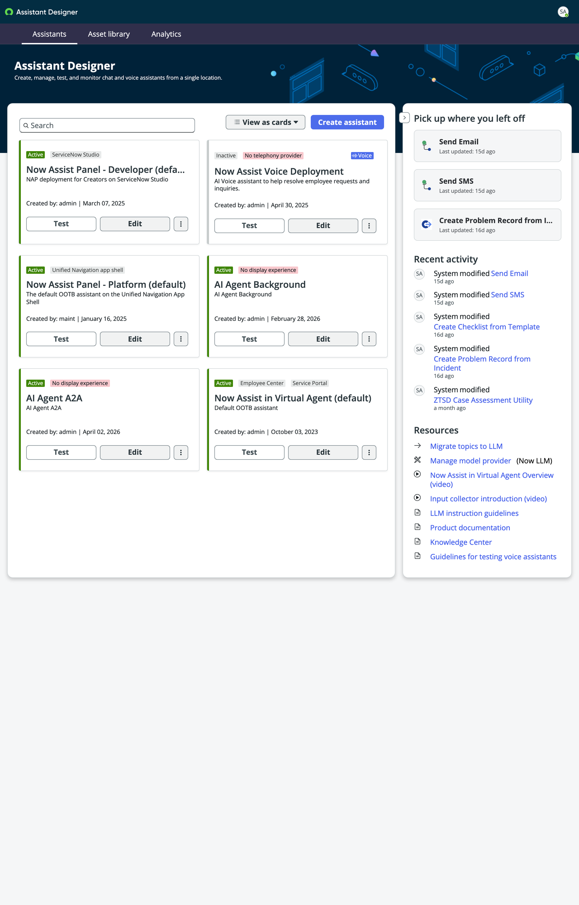
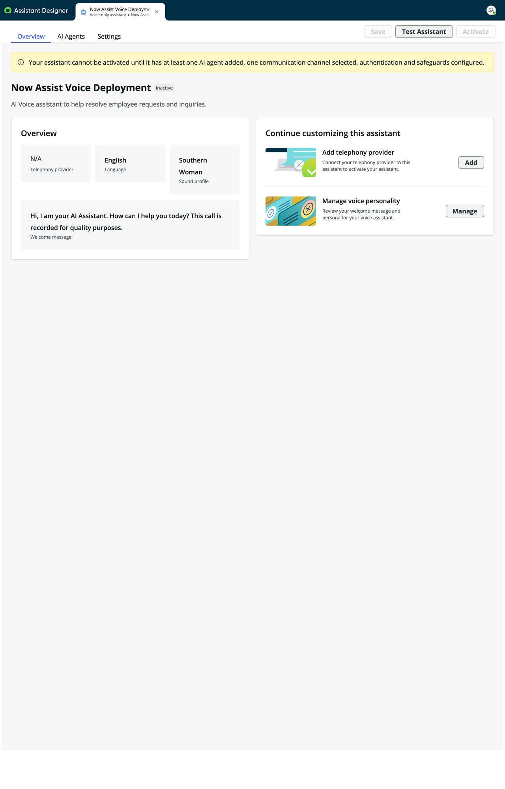

## Exercise 4: The End-to-End Flow

**Objective:** Put everything together! Use the Voice AI assistant to create an incident, assign it to the AI L1 Service Desk Specialist, and watch the full Zero Touch Support pipeline — from voice call through autonomous resolution — in action.

### Step 1 — Navigate to the Assistant Designer

1. In the filter navigator, type `Assistant Designer` and select **Conversational Interfaces > Assistant Designer**.
2. You'll land on the Assistant Designer page showing all configured assistants as cards.

   

### Step 2 — Start a Voice Test Call

1. Locate the **Now Assist Voice Deployment** card.
2. Select **Edit** to open the Voice Deployment configuration, then select **Test Assistant** in the top-right corner to open the Voice test interface.

   

3. Confirm the **Testing mode** is set to **Voice**.
4. Select **Start call** to initiate the voice conversation.
3. Confirm the **Testing mode** is set to **Voice**.
4. Select **Start call** to initiate the voice conversation.

   > Your browser may prompt you to allow microphone access — select **Allow** to proceed.

### Step 3 — Create an Incident via Voice

1. When the Voice AI greets you, describe your issue. For example:
   > *"Hi, I'm unable to connect Zscaler."*

2. The Voice AI will ask clarifying questions — answer naturally. For example:
   - *"Is the issue affecting all devices or just one?"* → "It's just my laptop."
   - *"Have you noticed any error messages?"* → "No, it just says cannot connect."
   - The Voice AI will confirm the details and let you know it's creating an incident.

3. On the **Analysis** panel (right side), watch for the **Create incident with voice AI agent** to appear with the status **Ongoing**, followed by the **Tool - Create incident flow action** marked as **Completed**.
4. Select **End call** when the conversation is complete.

### Step 4 — Open the Incident in Service Operations Workspace

1. Return to your main ServiceNow browser tab.
2. Select **Workspaces** in the top navigation bar.
3. Select **Service Operations Workspace** from the dropdown.
4. Locate the newly created incident (check the incident list for the most recent record, or search for the incident number shown in the Voice test Analysis panel).
5. Select the incident to open it.

### Step 5 — Assign the Incident to the AI L1 Service Desk Specialist

1. On the incident record, navigate to the **Details** tab.
2. Scroll down to the **Assignment** section.
3. In the **Assigned to** field, type `ai` and select **AI L1 Service Desk Specialist** from the dropdown.
4. An **Assign** dialog will appear — review the Now Assist-generated work notes summarizing the issue.
5. Select **Save** in the dialog to confirm the assignment.

   > Once saved, the incident state will change to **In Progress** and the AI L1 Service Desk Specialist will begin working the incident autonomously.

### Step 6 — Watch the Agentic Process in Action

1. On the right sidebar of the incident, locate and select the **Agentic Processes** menu item (the robot/agent icon).
2. You'll see the **Zero Touch Service Desk Agent** panel showing:
   - **Status:** In progress
   - **Owner:** AI L1 Service Desk Specialist
   - **Started at:** The timestamp when the process began
3. Select **Show steps** to expand the full step-by-step agentic process.
4. Observe the AI Specialist working through each stage:
   - ✅ Started AI Agent "Zero Touch Service..."
   - ✅ Fetching details of the given task
   - ✅ Task details fetched
   - ✅ Checked on remaining steps
   - ✅ Solution research complete
   - ✅ Data sources fetched
   - ✅ Finding potential solutions
   - ✅ Solutions fetched
   - ✅ Non-customer actions filtered
   - ✅ Executing the determined resolution...
   - 🔴 Started AI Agent "Zero Touch Service..." *(DEX remediation triggered)*

### Step 7 — Review the Resolution

1. In the incident **Activity** feed (center panel), review the work notes posted by the AI L1 Service Desk Specialist:
   - **[Now Assist generated]** — Recommended incident field updates
   - **Issue summary** — A detailed description of the issue and context
   - **Resolution notes** — The solution identified and actions taken
2. Confirm the incident fields have been updated by the AI Specialist (Category, Service, State, etc.).

### ✅ Final Checkpoint

You have successfully:
- Created an incident using the **Voice AI** assistant
- Assigned the incident to the **AI L1 Service Desk Specialist**
- Watched the AI Specialist autonomously classify, triage, investigate, and resolve the incident
- Observed the **DEX remediation trigger** activate for device-level fixes
- Reviewed AI-generated resolution notes and field updates

---

